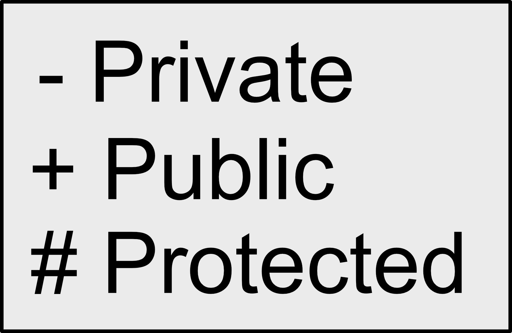

# Content
+ Functions
+ UML Class Diagram
+ Classes in Python


# Functions
## Defining a Function
```python
def function_name(parameters):
    pass
```

# Functions
## Function Parameters (1/3)
**Parameters could be one or more**
```python
def greet(name1, name2):
  prin('Hello', name1, name2)

greet("Jhon", "Snow")
```
**Unknown Number of Arguments**
```python
def greet(*names):
  print('Hello', names[0], ",", names[1])

greet("Jhon", "Snow")
```

# Functions
## Function Parameters (2/3)
**Keyword Arguments**
```python
def greet(name, lastname):
  print('Hello', name, lastname)

greet(lastname="Snow", name="Jhon")
```
__Keyword Argument **kwarg__
```python
def greet(**kwarg):
  print("Hello", kwarg["name"], kwarg["lastname"])

greet(firtsname="Jhon", name="Snow")
```

# Functions
## Function Parameters (3/3)
**Parameter with default value**
```python
def greet(name="My Friend"):
  print("Hello", name)

greet()
greet("Jhon")
```
**Function with Return value**
```python
def get_name():
  return "GHC"

name = get_name()
print('Hello', name)
```

# UML
## Class Diagram


# UML
## Visibility


# Class
## Definiton
```python
class class_name:
  pass
```

# Class
## Class Attibutes
```python
class Student:
  school = 'Hogwarts'
```
  
# Class
## Class Constructor
```python
class class_name:
  __init__(self):
    pass
```
# Class
## Class Properties
```python
class class_name:
  __init__(self, prop1, prop2):
    self.prop1 = prop1
    self.prop2 = prop2
```

