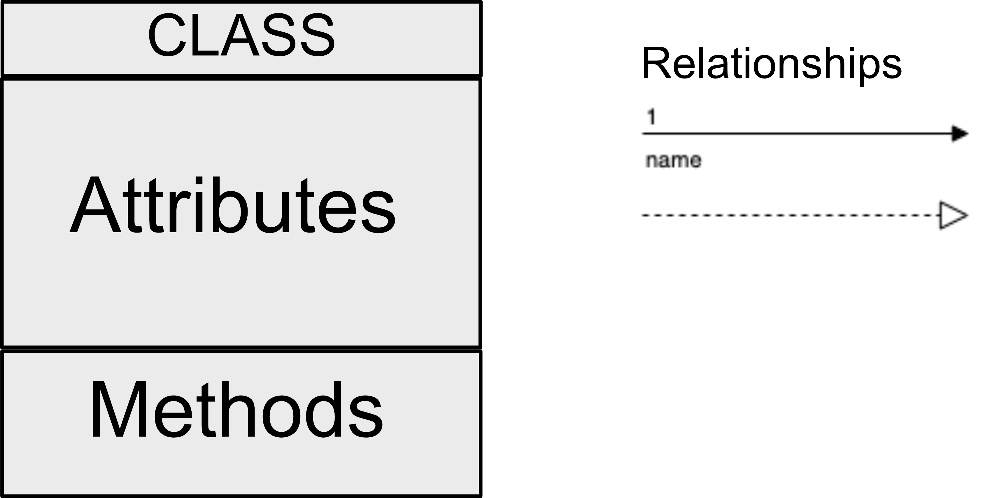

# Content
+ UML Class Diagram
+ Classes in Python
+ Attributes
+ Constructor
+ Methods
+ User Inputs

# UML
## Class Diagram


# UML
## Visibility


# Class
## Definiton
```python
class class_name:
  pass
```

# Class
## Class Attibutes
```python
class Student:
  school = 'Hogwarts'
```
  
# Class
## Class Constructor
```python
class class_name:
  __init__(self):
    pass
```

# Class
## Class Properties
```python
class class_name:
  __init__(self, prop1, prop2):
    self.prop1 = prop1
    self.prop2 = prop2
```

# Class
## Class Methods(1/2)
```python
class Person:
  def say_your_name(self):
    print(self.name)
```

# Class
## Class Methods(2/2)
**set/get methods**
```python
class Person:
  def get_name(self):
    return self.name
  def set_name(self, new_name):
    self.name = new_name
```

# User input
```python
# Input function allow the user enter values 
# through the console
username = input()
print("user entered: " + username)
```
