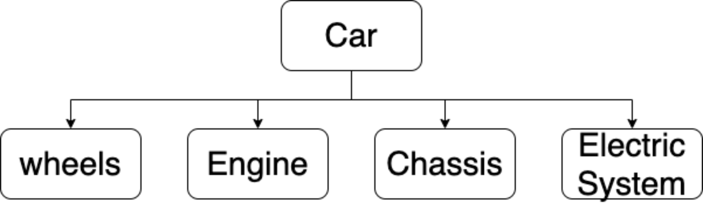
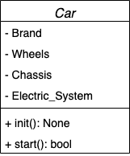
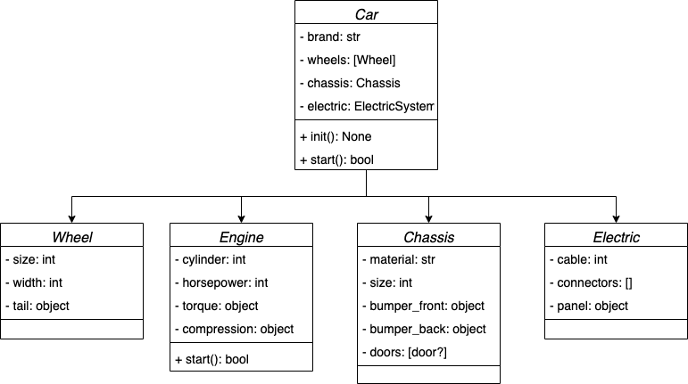
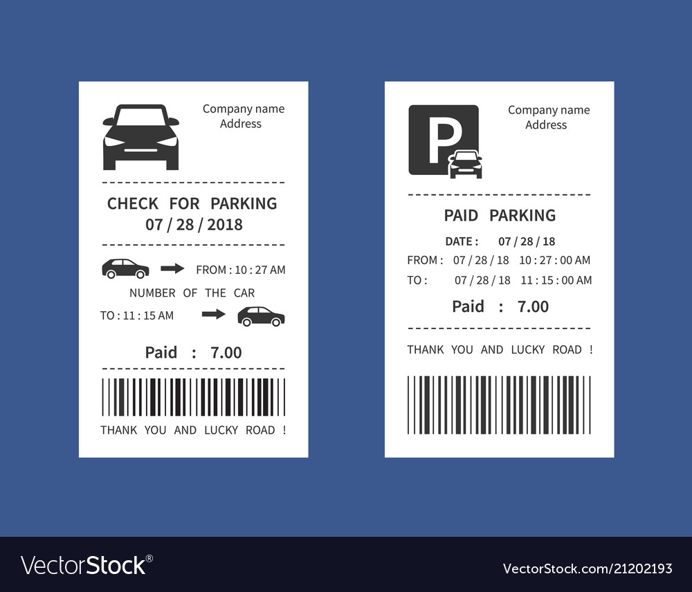

# Content
+ UML Object Diagram vs Class Diagram
+ Relationship between Classes 
+ Abstraction and Modularization
+ Single Responsibility Principle
+ The Clock
+ Exercice

# UML
## Object Diagram

# UML
## Object Diagram

# UML
## Class Diagram

# Abstraction and Modularization
**Abstraction**
Is the ability to ignore details to focus on the bigger picture.

**Modularization** 
Is the process of dividing large thing (problems) into small parts

# Single Responsibility Principle (SOLID)
A class should have a single responsibility

# Example

# Exe. The Clock
**We want to build a Clock with a European style (24 hours). Where the display shows the time from _00:00_ (midnight) to _23:59_ (one minute before midnight)**

# Homework
**I would like to automate my parking business adding a maching to collect the money
from all cars that came into the parking. The machine should do:**

- Get pay for each car that came to the parking
- Should manage a register of each car that mean:
  * The date/time that the car came into the parking
  * The date/time that the car came out
  * The amount that car must to pay
- The machine should print a ticket like

**Note:** The problem should contain at least a class diagram

# Ticket example

