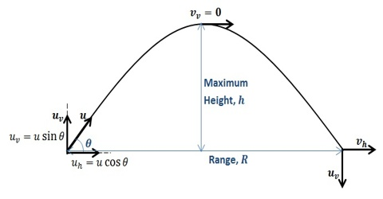
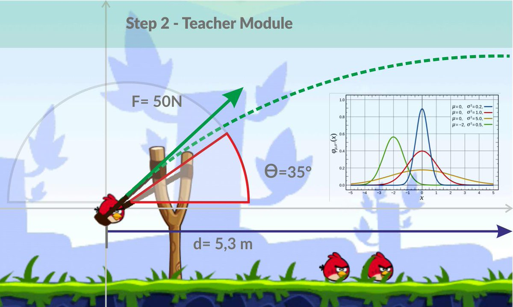
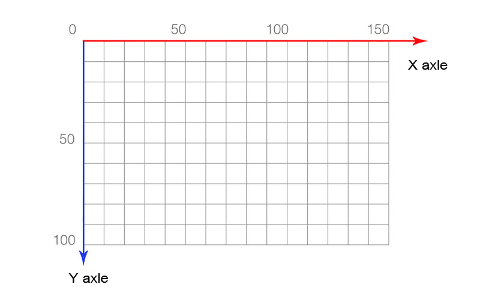
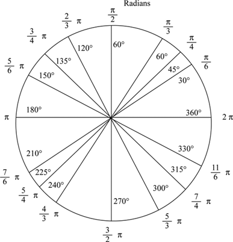
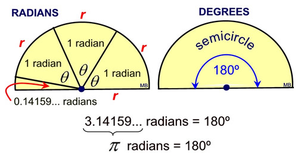

# Content
+ Lets refactor our static functions
+ Lets introduce constants
+ Use our Physics lib
+ Physics in games
+ Introducing pygame

# Physics


# Physics formulas
Vox = Vo * cos \<angle\>

Voy = Vo * sen \<angle\>

DistX = Vox * time

T = 2Vo sen\<angle\>

DistY = (Voy * T) + ((-gavity * (T)**2)/2) 

Where:
Vo = intial velocity
Vox = initial velocity in X
Voy = initial velocity in Y
T = run time
DistX = Distance in axis X
DistY = Distance in axis Y or height

# Refactor Physics Lib
In session-07 we tried to use the library with
static function but until use them we need to make
some changes into them

# Constants
```python
# Constants in python use capital letters
# Different ways to deffine into a project
# Could be deffinet out of the class in the top
# or into a different file (constants.py)
GRAVITY = 9.8
```

# Static Methods/Functions
```python
# to use static methods you can use the 
# following decorator
# Static functions not have the self parameter
@staticmethod
def my_method():
  pass
```

# Use the new Physics lib
A goalkeeper shoot the ball out of his goal
with velocity 26 m/s and 40 grade. Calculate:

+ The max height 
+ The distance
+ The time that the ball would be in the air

# Physics in games


# Pygame
*"Is a set of python modules designed for writing video games.
Pygame adds functionality on top of the excellent
SDL (Simple DirectMedia Layer) library"*

www.pygame.org/wiki/about

# Lets start with basics
## Computer axis


# Radians for parabolic movement


# Radians used in computer games


