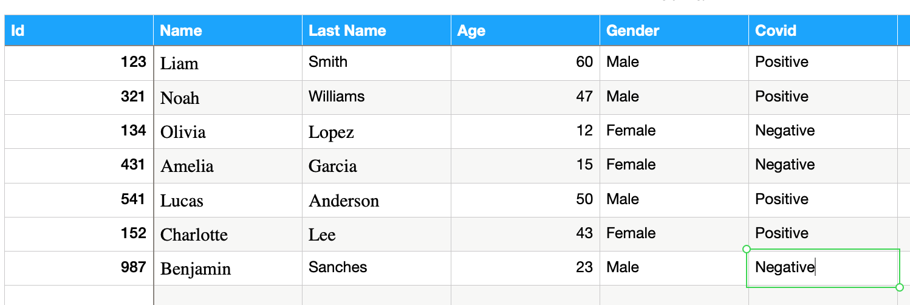

# Content
+ Practice

# Practice review previous requirements
You should added additional filters for:

+ Return sick and recovered people according they gender
+ Return sick and recovered people according they age

# Practice - Fourth requirement
From where we should take all this infomation to generate this reports?

I think, we should contact to the hospitals. And ask them for persons that 
have the sikness.

# Practice
## Lets use a .csv file as an input

