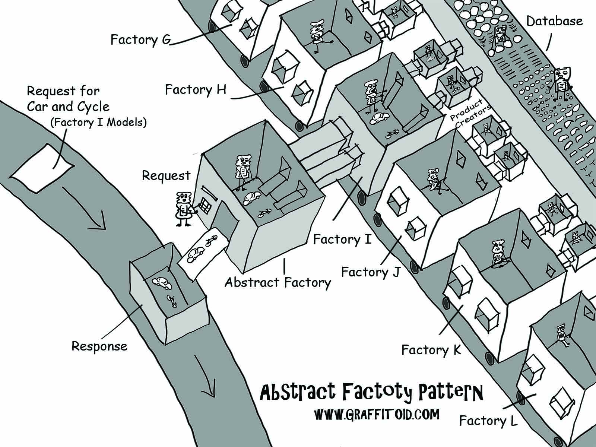

# Content
+ Service to test
+ Design Patterns (Abstract Factory)
+ SOLID
+ Practice

# Service to test
## Flask
Is a micro web framework written in Python.
```python
# Example code to show a "Hello World"
from flask import Flask
app = Flask(__name__)

@app.route("/")
def hello():
    return "Hello World"


if __name__ == "__main__":
    app.run(debug=False)
```

# Design Patterns
## Abstract Factory
Is a creational design pattern that lets you produce families of related objects
without spedifying their concrete classes.


# SOLID
* S -> Single responsability 
* O -> Open and Close (open for extension but closed for modification)
* L -> Liskov Substitution
* I -> Interface Segregation 
* D -> Dependency Inversion 

# Practice
## Lets use the good practices
+ Try to implement/refactor an Abtract Factory into Pandemic project


